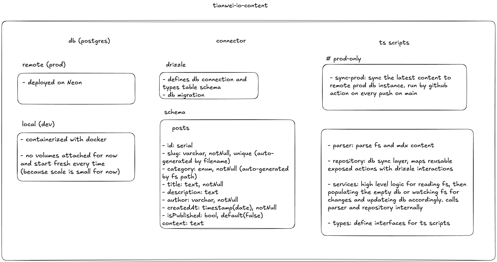

<!-- markdownlint-disable MD007 MD033 MD041 -->
<samp>
<h1>tianwei-io-content</h1>

Content engine for [tianwei.io](https://tianwei.io).

This repository is the **source of truth for MDX content** and the **sync layer** that keeps a PostgreSQL database up to date for the api layer to read from. It parses local `.mdx` files, manages a local Postgres container for development, and syncs content to a remote Neon Postgres instance for production.

<h2>Stack</h2>

- **Runtime**: [Node.js](https://nodejs.org) + [TypeScript](https://www.typescriptlang.org)
- **ORM**: [Drizzle ORM](https://orm.drizzle.team)
- **Database**: [PostgreSQL](https://www.postgresql.org)
- **Remote DB Host**: [Neon](https://neon.tech)
- **Content Format**: [MDX](https://mdxjs.com) files with frontmatter
- **Infrastructure**: [Docker](https://www.docker.com) Compose (local Postgres), [GitHub Actions](https://docs.github.com/en/actions) (remote sync)

<h2>Overview</h2>



<h2>Local Run</h2>

Make sure **Docker** and **Node.js** (with `pnpm`) installed.

```shell
git clone git@github.com:notbd/tianwei-io-content.git
cd tianwei-io-content
pnpm install

# Start local Postgres in Docker and run the content sync + watcher
pnpm run dev:up

# After finishing, shut everything down cleanly
pnpm run dev:down
```

After `pnpm run dev:up`:

- A fresh Postgres container is started and exposed at `localhost:5431`.
- The sync scripts read all `.mdx` files and upsert them into the database as `posts` entries.
- A watcher process keeps running to apply file changes to the DB in real-time.

Database can be inspected with any SQL client (e.g. [BeeKeeper Studio](https://beekeeperstudio.io)) using the connection details from the `.env.local` file.

<h2>Env Configuration</h2>

This repo uses environment variables for both **local** and **remote** database connections. See `.env.example` for the full list.

For local development, ensure `.env.local` (or equivalent) is configured correctly before running `pnpm run dev:up`.

<h2>Content Sync to Prod</h2>

Production sync is fully automated:

- [Neon](https://neon.tech) Postgres is configured as the remote production database.
- A dedicated script connects to Neon and performs a **one-shot sync** of all MDX content.
- A GitHub Actions workflow (`.github/workflows/deploy-content.yml`) runs on every push to `main` and syncs the content to Neon.

Result: the **remote database is always in sync** with the MDX content stored in the `main` branch of this repo.

<h2>License</h2>

Source code is licensed under <a href='./LICENSE'>AGPLv3</a>,<br>
The content is licensed under <a href='https://creativecommons.org/licenses/by-nc-sa/4.0/'>CC BY-NC-SA 4.0</a>.
</samp>
